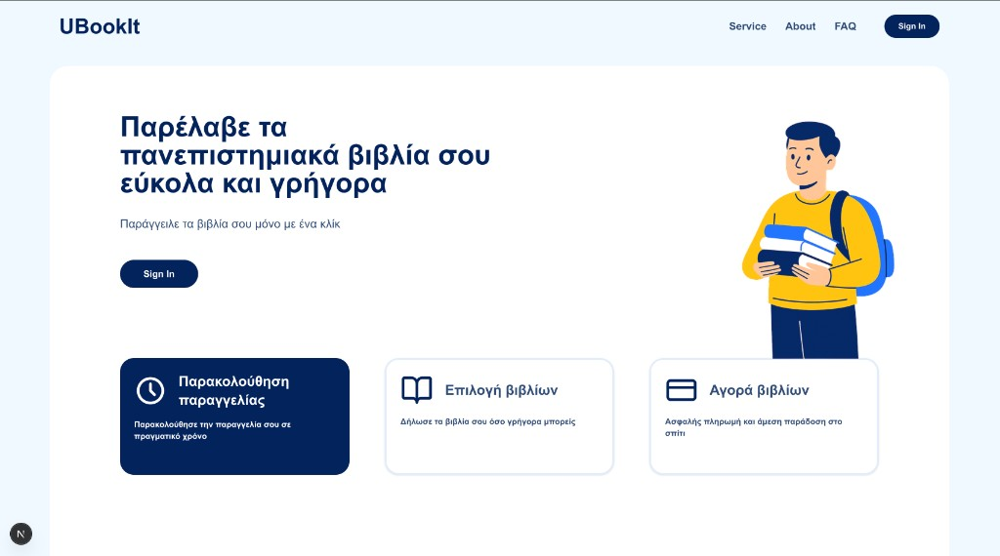
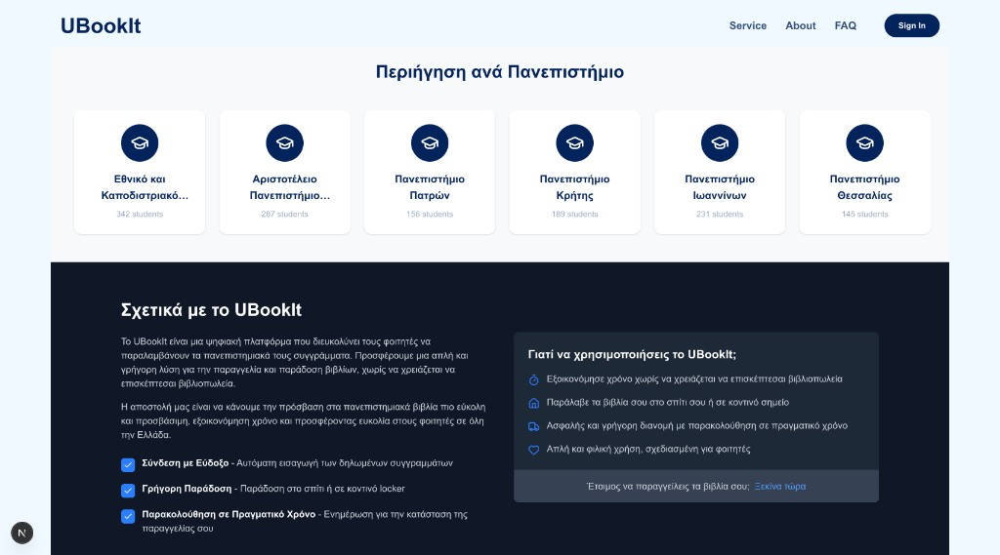
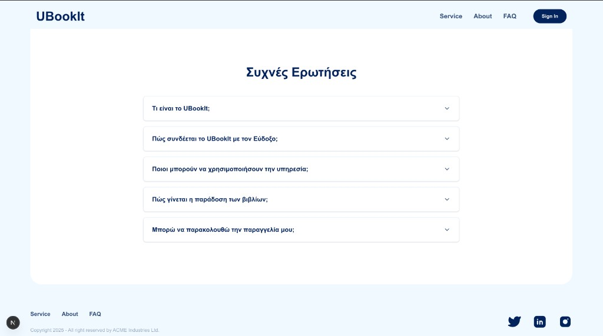
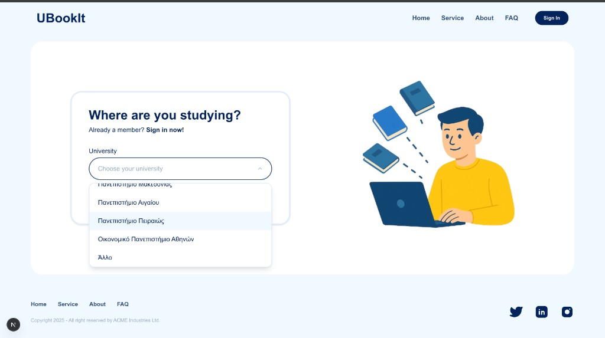
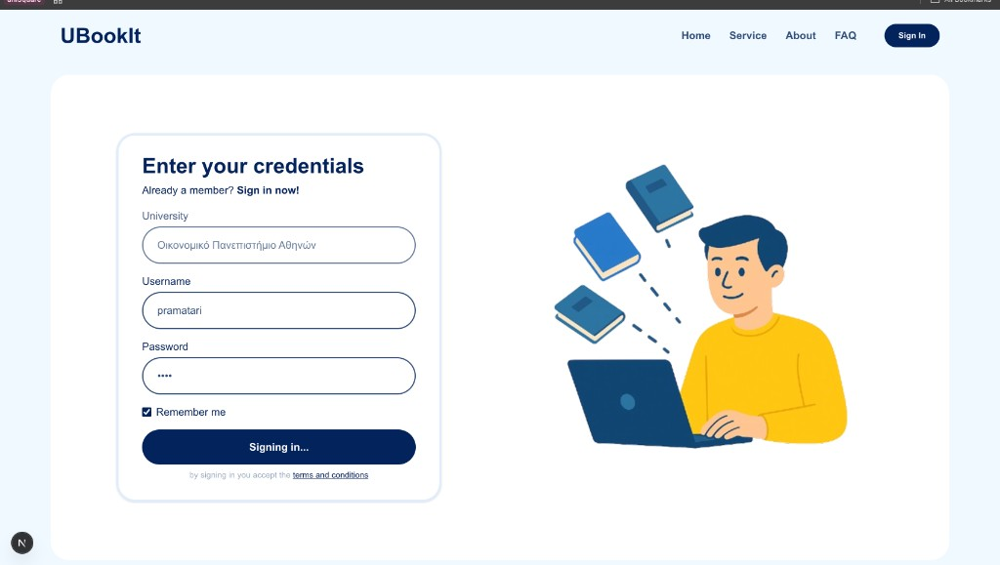
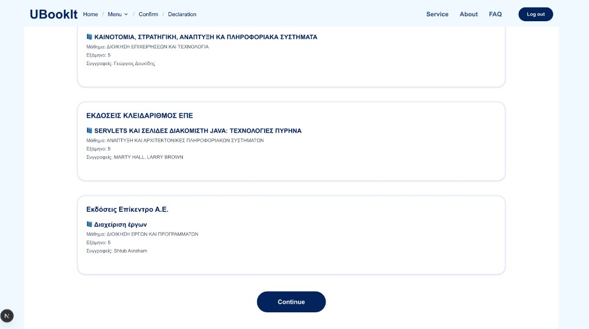
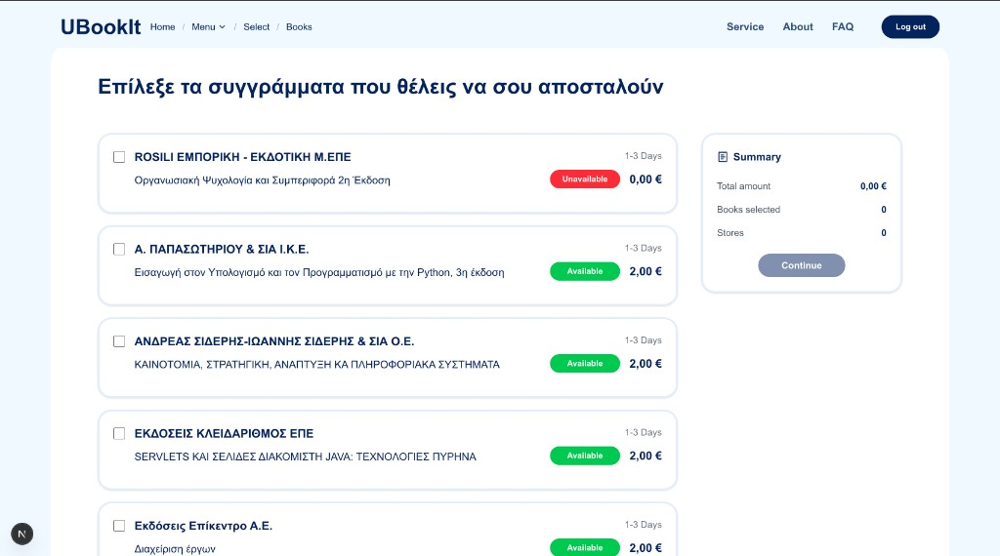
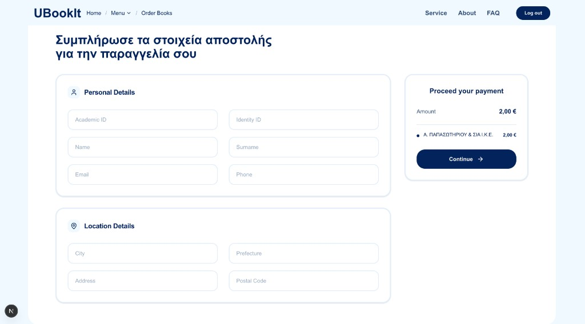
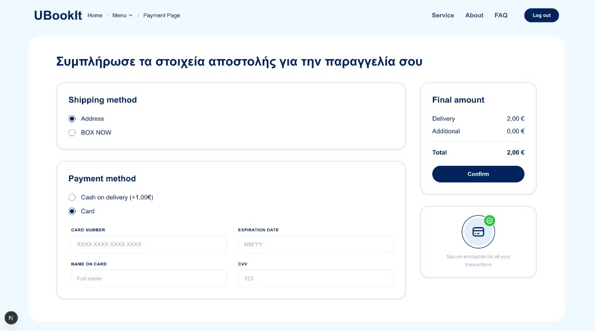
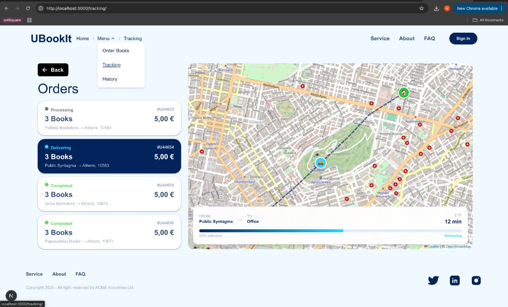

# UBookIt

A digital platform that helps Greek university students order and receive their academic textbooks with ease. UBookIt connects with Eudoxus and offers a simple solution for book ordering and delivery, eliminating the need to visit physical bookstores.

## Screenshots

### Landing Page



### Landing Page — Browse by University



### Landing Page - FAQ




### Sign Up



### Login




### Book Declaration Confirmation



### Book Selection




### Order & Shipping Details



### Payment



### Order Tracking



## Tech Stack

- **Framework:** Next.js 15 (React 19)
- **Styling:** Tailwind CSS 4, FlyonUI
- **Maps:** Leaflet / React-Leaflet
- **Icons:** Lucide, Tabler Icons, Font Awesome
- **Language:** TypeScript

## Getting Started

```bash
npm install
npm run dev
```

The app will be available at [http://localhost:3000](http://localhost:3000).
